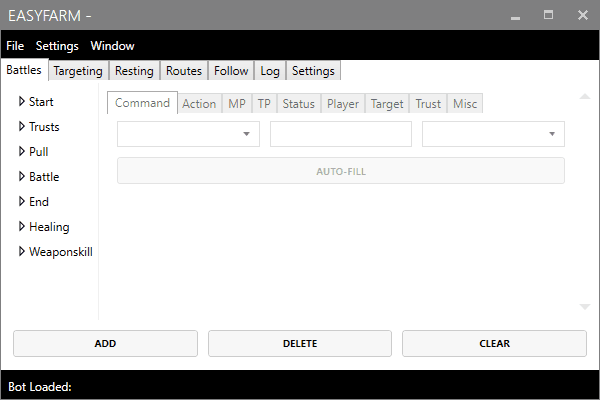

# Character Selection

EasyFarm requires that you select a character before starting. Currently, the program only supports controlling one character at a time. However, multiple instances of EasyFarm can be run simultaneously, allowing for multiple characters to be farming at the same time. 

## Selecting a character

In order to begin farming, you must first select a character. Go to File &gt; Select Character ... to begin choosing your character. 

The Select Character screen shows the available processes on the computer. You want to select the process which contains the name of your character to begin. 

