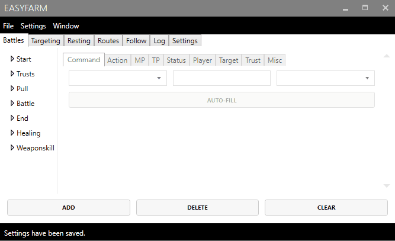

# Manage Settings

EasyFarm supports saving and loading of multiple settings files. There is no limit to the number of settings file you can create. You can create settings files for specific jobs, characters, or tasks. 

## Saving Settings

Settings can be saved by going to the file menu and selecting Settings &gt; Save

## Loading Settings

Settings can also be loaded by going to the file menu and selecting Settings &gt; Load.

