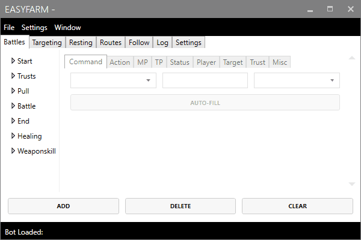

# Start Program

Once you've selected your character, you can now begin farming! The File &gt; Start / Stop command will tell your character when to farming. The stop command has been programmed to cease farming immediately after being clicked no matter what operation that program is currently performing. 

## Starting the program

Once you've selected your character, you may select File &gt; Start from the file menu to begin farming. 

## Stopping the program

You may stop the program at any time by selecting File &gt; Start in the File menu. 

